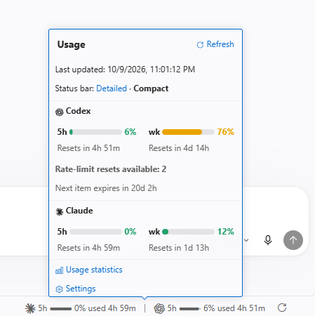
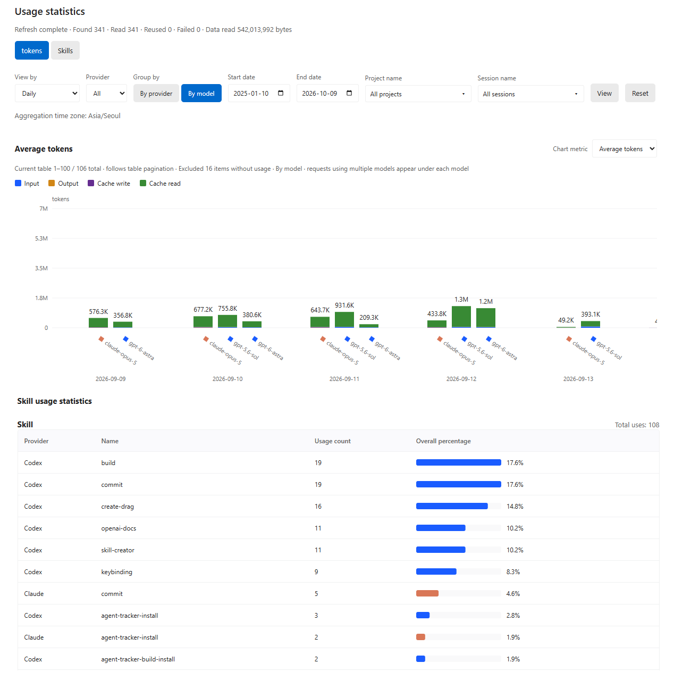

<p align="center">
  <a href="README.md">English</a> |
  <a href="README.ko.md">한국어</a> |
  <a href="README.zh.md">简体中文</a> |
  <strong><a href="README.ja.md">日本語</a></strong> |
  <a href="README.es.md">Español</a> |
  <a href="README.fr.md">Français</a>
</p>

# Agent Tracker

Claude・Codex の現在の使用量とリセットまでの時間を表示し、会話ログからトークン使用量と所要時間を追跡する VS Code 拡張機能です。

## 主な機能

### ステータスバーで使用量を確認

- **現在の使用量** — VS Code のステータスバーで、Claude・Codex のサブスクリプション使用率とリセットまでの時間を確認できます。
- **詳細カード** — クリックすると、5時間・週間の使用量、リセット時刻、Codex の利用可能な使用量リセット回数などを表示します。
- **自動・手動更新** — 既定では15分ごとに取得します。更新ボタンで直ちに取得することもできます。



### 会話・期間・モデル別にトークンと時間を比較

- **トークン・時間の統計** — 会話・日・月・プロジェクト・モデル別の合計トークン数、リクエスト当たりの平均トークン数、平均所要時間を表とグラフで確認できます。
- **利用記録** — スキル・プラグイン・サブエージェント・モデルの利用回数と割合を確認できます。
- **使い方の改善** — モデルの変更やスキル・プラグインの導入前後で、リクエスト当たりの平均トークン数と時間を比較し、エージェントの使い方を調整できます。



カードの **使用統計**、またはコマンドパレットの **Agent Tracker：使用統計を開く** から開きます。統計は画面を開く際にローカルの会話ログから計算します。

## インストールとアンインストール

### インストール

Node.js **22.15 以降**、VS Code **1.101 以降**、ターミナルで実行できる `code` コマンドが必要です。先に Claude Code または Codex CLI でログインしてください。

```sh
npx agent-tracker-vscode@latest
```

npm でインストーラーのコマンドをグローバルに登録する場合は、次を実行します。

```sh
npm install -g agent-tracker-vscode@latest
agent-tracker-vscode
```

インストール後、VS Code のコマンドパレットで **Developer: Reload Window** を実行します。更新にも同じインストールコマンドを使います。macOS で `code` コマンドがない場合は、先に **Shell Command: Install 'code' command in PATH** を実行してください。

特定のプロファイルにインストールする場合は、作成済みのプロファイル名を指定します。

```sh
npx agent-tracker-vscode@latest --profile "Work"
```

ステータスバーの項目を再度クリックしてカードを閉じるには、任意の [ローカル VS Code パッチ（韓国語）](docs/research/StatusBarPopup.md) が必要です。

### アンインストール

VS Code の拡張機能一覧から **Agent Tracker → アンインストール** を選ぶか、次を実行します。

```sh
code --uninstall-extension agent-tracker.agent-tracker
```

特定のプロファイルにインストールした場合は、削除コマンドにも `--profile "Work"` を付けます。グローバルにインストールした npm パッケージも削除する場合は、次を実行します。

```sh
npm uninstall -g agent-tracker-vscode
```

npm パッケージと VS Code 拡張機能はそれぞれアンインストールします。

## VS Code 拡張機能の設定

カードの **設定** をクリックするか、VS Code の設定で `@ext:agent-tracker.agent-tracker` を検索します。
以下の設定キーにはすべて `agentTracker.` 接頭辞が付きます。

| 設定 | 既定値 | 説明 |
| --- | --- | --- |
| `language` | `auto` | VS Code の言語に従う。韓国語・英語・簡体字中国語・日本語・スペイン語・フランス語を選択可能 |
| `claude.enabled` / `codex.enabled` | `true` | プロバイダー別の使用量取得・ログ統計の追跡 |
| `quota.refreshPolicy` | `automatic` | 自動で取得。`manual` は更新ボタンを押したときのみ取得 |
| `quota.pollingIntervalSeconds` | `900` | 自動取得の間隔（秒）。最小30秒、非アクティブなウィンドウでは一時停止 |
| `codex.showStatusBar` | `true` | ステータスバーに Codex を表示。非表示でも使用量の取得は継続 |
| `display.percentage` | `used` | 使用率を表示。`remaining` は残りの割合を表示 |
| `display.detail` | `detailed` | 7日・5時間の使用量を表示。`compact` は5時間のみ表示 |
| `display.colorMode` | `automatic` | テーマの色を使用。`white`・`black`・`custom` も選択可能 |
| `display.customColor` | `#ffffff` | `custom` モードで使用する HEX カラー |
| `codex.showReserve` | `false` | アカウントで提供される GPT Reserve の使用量を表示 |
| `codex.showResetCredits` | `true` | アカウントで提供される使用量リセット回数と次の有効期限を表示 |
| `usage.enabled` | `true` | ローカル会話ログのトークン・時間統計を有効化 |
| `usage.skillsEnabled` | `true` | スキル・プラグイン・サブエージェント・モデルの利用回数を集計 |
| `usage.showApiCosts` | `false` | API 推定費用（USD）を表示。サブスクリプション利用は0と表示 |
| `usage.excludeEmptyUsage` | `true` | モデル・トークン情報がどちらもないリクエストをグラフと平均から除外。表には残す |
| `usage.timezone` | システムのタイムゾーン | 日・月統計の基準タイムゾーン。例：`Asia/Seoul` |
| `dataHome` | `~` | `.claude`・`.codex` を含む共通の親フォルダー。ユーザー設定で指定 |
| `claude.cleanupPeriodDays` | `null` | Claude のログ保持日数。1以上で Claude の設定に反映し、`null` は既存の値を維持 |
| `codex.executable` | `codex` | Codex CLI コマンドまたは実行ファイルのパス |

**Agent Tracker：統計計算データを削除** で集計結果を初期化できます。元の会話ログは保持され、統計画面を再度開くと再計算します。

[利用・開発リファレンス（韓国語）](docs/Development.ko.md)
